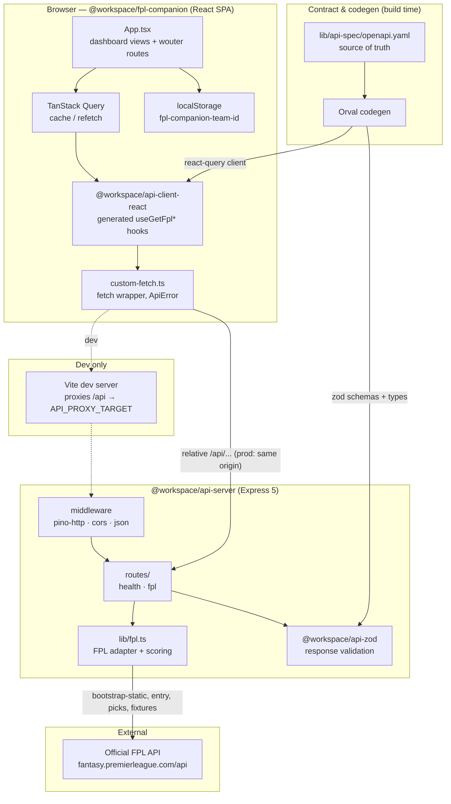
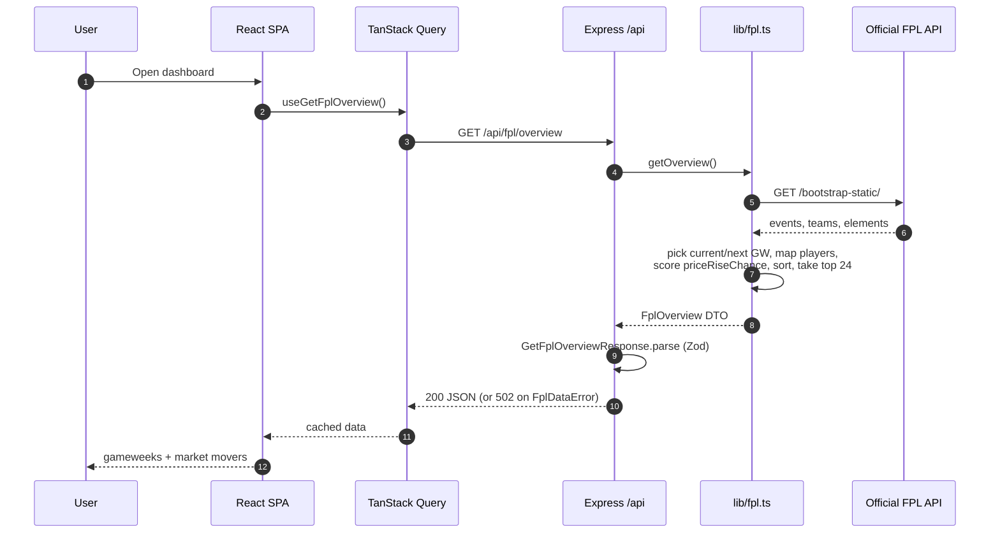
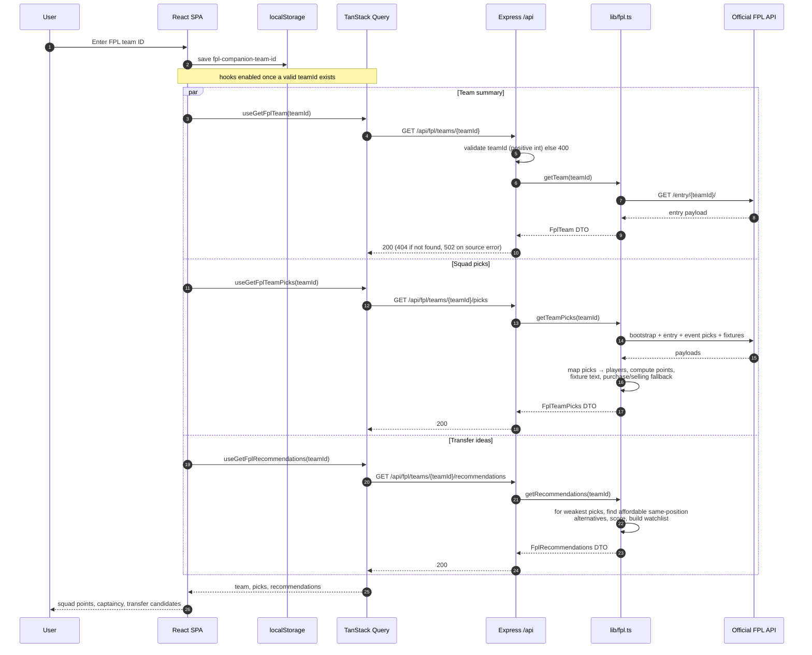

# FPL Companion — Architecture & Sequence Diagrams

A live Fantasy Premier League dashboard. The React SPA renders gameweek state,
market movers, live squad points, and explainable transfer ideas. An Express
API server fetches the official FPL feed server-side (so the browser never
depends on third-party CORS), reshapes it into typed DTOs, and computes
price-rise, expected-performance, fixture-run, and recommendation scores.

## System architecture

### Component notes

- **fpl-companion** — Vite + React + Tailwind + shadcn/ui. State/data via
  TanStack Query; routing via `wouter`. The entered FPL team ID is persisted in
  `localStorage` (`fpl-companion-team-id`); no accounts or credentials.
- **api-client-react** — Orval-generated React Query hooks (`useGetFplOverview`,
  `useGetFplTeam`, `useGetFplTeamPicks`, `useGetFplRecommendations`) that call a
  shared `customFetch` wrapper. Requests use relative `/api/...` paths.
- **api-server** — Express 5. `app.ts` wires `pino-http`, `cors`, body parsers,
  and mounts the router under `/api`. `routes/fpl.ts` validates params, calls the
  adapter, and re-validates responses with Zod before sending.
- **lib/fpl.ts** — the only place that talks to the official FPL API. Fetches
  `bootstrap-static`, `entry/{id}`, `entry/{id}/event/{gw}/picks`, and
  `fixtures`, maps raw payloads to DTOs, and computes `priceRiseChance`,
  expected-goal involvement per 90, availability, five-fixture difficulty,
  momentum, and transfer `recommendations`/`watchlist`. This is the baseline
  analytics provider; a separately licensed provider can be added behind this
  boundary for event-level or odds data.
- **api-spec / Orval** — `openapi.yaml` is the contract; codegen produces both the
  client hooks and the Zod schemas, keeping client and server types in sync.

## Sequence: Market overview load (no team ID)

## Sequence: Enter team ID → picks & recommendations

## Request path (dev vs prod)

- **Dev**: SPA (Vite dev server) serves the app and proxies `/api` → the API
  server (`API_PROXY_TARGET`, default `http://localhost:5000`). The client makes
  no `setBaseUrl` call, so relative paths must be proxied.
- **Prod (Replit)**: a router combines both services under one origin, so the
  relative `/api/...` paths resolve to the API server directly
  (see `artifacts/*/.replit-artifact/artifact.toml`).
